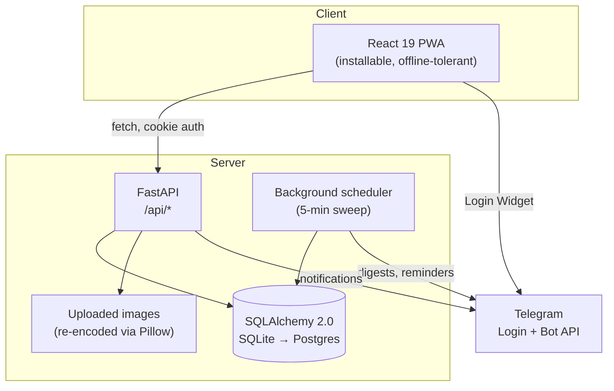

# Architecture

Mahalladosh is a mobile-first PWA for Uzbek *mahalla* (neighbourhood) communities.
This document explains how it is put together and — more importantly — **why**, since
most of the interesting decisions here are driven by two unusual constraints:

1. **The users are largely elderly.** Many read Cyrillic Uzbek rather than Latin, many
   are on cheap Android phones and intermittent mobile data, and few will tolerate a
   flow deeper than two taps.
2. **The unit of trust is the household, not the account.** A mahalla is a real place
   with real families in it. Identity, privacy, and moderation are all modelled around
   verified families vouching for each other — not around follower counts.

---

## 1. System shape



There is deliberately **no message broker, no cache layer, and no microservice split.**
The pilot is one district. Introducing that infrastructure now would buy scaling
headroom the product does not need yet, at the cost of operational surface that a
two-person team cannot maintain. The seams that *would* need to change first
(session storage, the outbound Telegram path, image storage) are each isolated behind
a single module so they can be swapped without touching feature code.

---

## 2. Backend (`api/`)

FastAPI + SQLAlchemy 2.0 (typed `Mapped[...]` models) + Pydantic v2, on Python 3.12.

```
api/app/
  main.py         app assembly, CORS, router mounting, lifespan
  config.py       pydantic-settings; all env in one place
  db.py           engine + SessionLocal + declarative Base
  models.py       every table (see §2.2)
  schemas.py      Pydantic request/response contracts
  deps.py         auth + membership dependencies — the security chokepoint
  security.py     JWT issue/verify, Telegram login signature check
  routers/        one module per resource
  notify.py       in-app notification fan-out
  scheduler.py    time-based work (votes closing, reminders, honours, digests)
  reputation.py   obro' (honour) point ledger
  presenters.py   ORM → response shaping, incl. the privacy gate
  track.py        lightweight event logging
  seed.py         reference geography + idempotent bootstrap
```

### 2.1 Authorization lives in `deps.py`, on purpose

Every authenticated route resolves through `get_current_user`, and every
mahalla-scoped route additionally through `require_member`. Both live in one file so
that the answer to *"can this person do this?"* has exactly one place to be wrong.

Two consequences worth calling out:

- **Sessions are stateless JWTs in an httpOnly cookie** (`md_session`). That means a
  cookie cannot be un-issued — so the ban/deletion check is enforced *server-side in
  `get_current_user`*, not by clearing the cookie. A banned user who kept their token
  is rejected on every authenticated route, including `/me`.
- **Cross-mahalla lookups return 404, not 403.** A `403` confirms that the id exists;
  a `404` does not. For user-directed actions like reporting, that difference is the
  gap between "you can't do that" and an identity-enumeration oracle.

### 2.2 The data model

Entities cluster into six groups:

| Group | Tables | Role |
|---|---|---|
| **Geography** | `regions`, `districts`, `mahallas` | Reference data, seeded. A mahalla opens only after a petition passes. |
| **Identity & trust** | `users`, `households`, `household_members`, `household_join_requests`, `vouches` | The moat. A household is a roster; an account *claims* a row on it. |
| **Content** | `posts`, `post_responses`, `service_offerings` | The mutual-aid loop and the neighbourhood services board. |
| **Governance** | `proposals`, `proposal_seconds`, `votes` | propose → second → vote, closed by the scheduler at deadline. |
| **Honour** | `reputation_entries`, `month_honors` | Append-only point ledger; monthly *Faol qo'shni*. |
| **Safety & signal** | `reports`, `ban_records`, `notifications`, `event_log`, `user_activity` | Moderation ledger with repeat-offender escalation, plus analytics. |

Two modelling decisions carry weight:

**A household member is a row, not an account.** A family lists its members —
including elders who will never install the app. When a real person later signs up,
they *claim* their existing row rather than creating a duplicate. Claiming requires
**steward approval**, because otherwise anyone could attach themselves to any family
and inherit its stewardship. Leaving or deleting an account releases the link but
keeps the roster row, so a family's record of itself survives individual churn.

**Honour is an append-only ledger, never a mutable counter.** `reputation_entries`
records *why* each point was earned; totals are derived. That makes the monthly
leaderboard auditable and reversible — a moderation action can withdraw the entry
that a takedown invalidated instead of guessing at a running total.

### 2.3 The scheduler

`scheduler.py` runs a sweep every five minutes inside the API process, and once at
startup to catch up on work missed while the process was down (votes past their
deadline, an unawarded monthly honour). Each step is individually guarded: one failing
step cannot prevent the others from running, because a crash in the digest sender must
not also stop votes from closing.

This is in-process rather than a separate worker for the same reason there is no
broker — one district's worth of periodic work does not justify a second deployable.

### 2.4 Images

Uploads are re-encoded through Pillow rather than stored as received. That normalizes
dimensions and strips EXIF (including GPS, which matters when the subject is somebody's
house), and it means a malformed file fails at the encoder rather than at whatever
later reads it.

---

## 3. Frontend (`web/`)

React 19 + TypeScript (strict) + Vite + Tailwind v4 + TanStack Query + Zustand,
installable via `vite-plugin-pwa`.

### 3.1 The `core/` rule

```
web/src/
  core/           NO UI IMPORTS, NO DOM  ←  the enforced boundary
    api/          typed fetch client + shared types
    queries/      TanStack Query hooks — server state
    stores/       Zustand — auth + preferences
    i18n/         per-feature string dictionaries
    levels.ts     honour → level derivation
  components/     shared primitives (ui.tsx, layout, LanguageSwitcher)
  screens/        route-level composition only
```

`core/` contains every piece of logic that is not pixels: API calls, cache keys,
invalidation rules, derived values, and all copy. `screens/` composes. The rule exists
because a native Android client is the likely next surface — Uzbek phone users install
apps from Play, not from a browser prompt — and this boundary is what makes that a
re-skin rather than a rewrite.

### 3.2 Four languages, permanently

`Lang = 'uz' | 'uzc' | 'ru' | 'en'` — Latin Uzbek (default), **Cyrillic Uzbek**,
Russian, English. Cyrillic Uzbek is not an afterthought and is not Russian: it is the
script an Uzbek grandmother actually reads fluently, and the target user *is* that
grandmother. Every string ships in all four or it does not ship.

Strings live in per-feature dictionaries (`core/i18n/<feature>.ts`) consumed by
`useStrings(dict)`, with `fmt(template, vars)` for interpolation. Per-feature rather
than one global file so that adding a screen touches one dictionary, and a missing
translation is a type error rather than a runtime fallback to English.

### 3.3 Offline tolerance

Poor connectivity must never look like being logged out — for this audience, a
surprise login screen is where the session ends permanently. Auth state is treated as
sticky: a failed request degrades the screen it belongs to, and only a genuine `401`
from the server clears the session.

---

## 4. Testing & CI

```bash
cd api && pytest          # hermetic: own test.db, schema rebuilt per test
cd api && ruff check .    # E,W,F,I,B,UP,C4
cd web && npm run build   # tsc --noEmit && vite build
```

GitHub Actions runs all three on every push and PR (`.github/workflows/ci.yml`).

The suite is deliberately weighted toward **authorization and trust boundaries** over
line coverage. Each confirmed finding from the security review has a pinned regression
test in `tests/test_security.py`, named for the thing it prevents — so a future
refactor that reopens the hole fails loudly instead of quietly.

One test worth reading as documentation: `test_deleted_account_cannot_reuse_its_token`
captures the session cookie *before* account deletion and re-sends it afterwards. The
naive version of that test passes for the wrong reason, because the test client
cooperatively drops the cleared cookie and never actually exercises the server check.

---

## 5. Data & schema evolution

Development builds the schema directly from the models via `Base.metadata.create_all`,
with `demo_seed.py` producing a realistic populated mahalla. There is no migration
tool yet, which is a deliberate pre-launch trade: the schema is still moving weekly,
and hand-maintaining migrations for a database with no production rows is pure
overhead. **Adding Alembic is a prerequisite for the first real deployment**, and is
tracked as such in [ROADMAP.md](ROADMAP.md).

---

## 6. Known trade-offs

Stated plainly, because pretending they do not exist is worse than owning them:

- **No migrations yet** (§5) — blocks production, scheduled before launch.
- **SQLite in development.** The engine is configured from `DATABASE_URL`; Postgres is
  a config change, but the swap is not yet exercised in CI.
- **In-process scheduler.** Fine for one instance; horizontal scaling would need the
  sweep extracted with a lock, since two instances would double-send.
- **`list_households` issues per-household queries.** Invisible at pilot scale and
  knowingly left alone: the privacy gate lives in that path, and duplicating it into a
  batch loader is precisely where an access-control divergence would be introduced.
- **Stateless sessions cannot be revoked individually** — mitigated by the server-side
  lockout check (§2.1), but a compromised token stays valid until it expires.
